# Use Azure Machine Learning Designer

## Overview

Azure Machine Learning *designer* provides a drag & drop environment in which you can define a workflow, or *pipeline* of data ingestion, transformation, and model training modules to create a machine learning model. You can then publish this pipeline as a web service that client applications can use for *inferencing* (generating predictions from new data).

## Create a dataset

Now that you have some compute resources that you can use to process data, you'll need a way to store and ingest the data to be processed.

1. On the LabVM browser open a new tab and browse https://aka.ms/diabetes-data. Give **Ctri+S** to save this as a local file named **diabetes.csv** (it doesn't matter where you save it).

2. In Azure Machine Learning Studio, in **Assets** pane select **Data** option on the left panel. Data assets represent specific data files or tables that you plan to work with in Azure ML.

3. Create a new dataset from local files, using the following settings:

    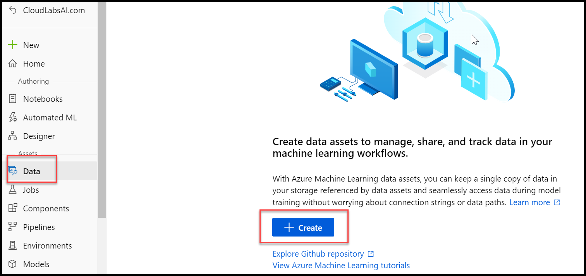
    
    * **Basic Info**:
        * **Name**: diabetesdataset
        * **type**: Tabular
        * **Description**: Diabetes data
        
    * **On data source pane Choose from local files option then click on next.**:
    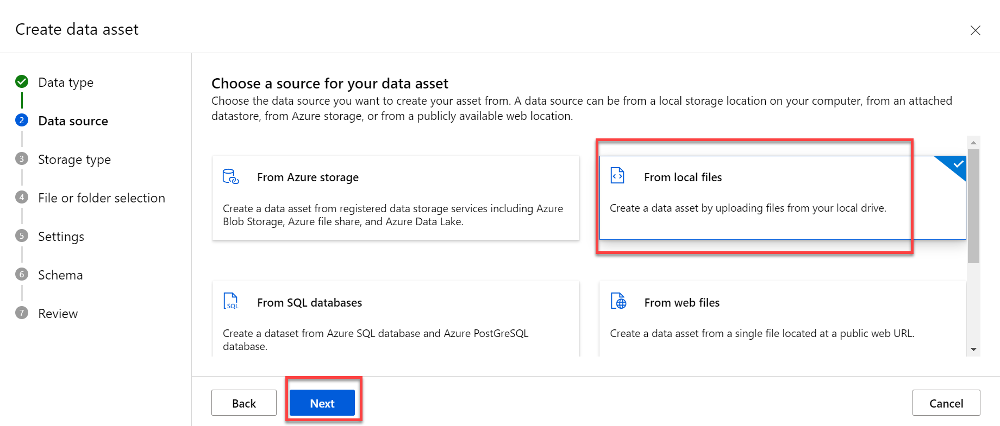
    
    * **On storage type pane leave the default then click on next**:
        * **Upload path**: *Leave the default selection*

    * **File or folder selection pane upload your file, then click on next.**:
        * **Select or create a datastore**: Currently selected datastore
        * **Select files for your dataset**: click on upload and Browse to the **diabetes.csv** file you downloaded.
        
        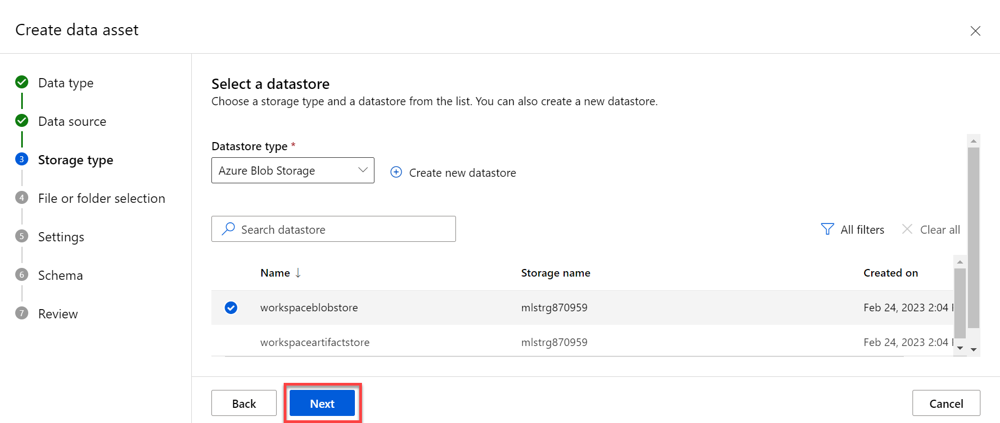
    
        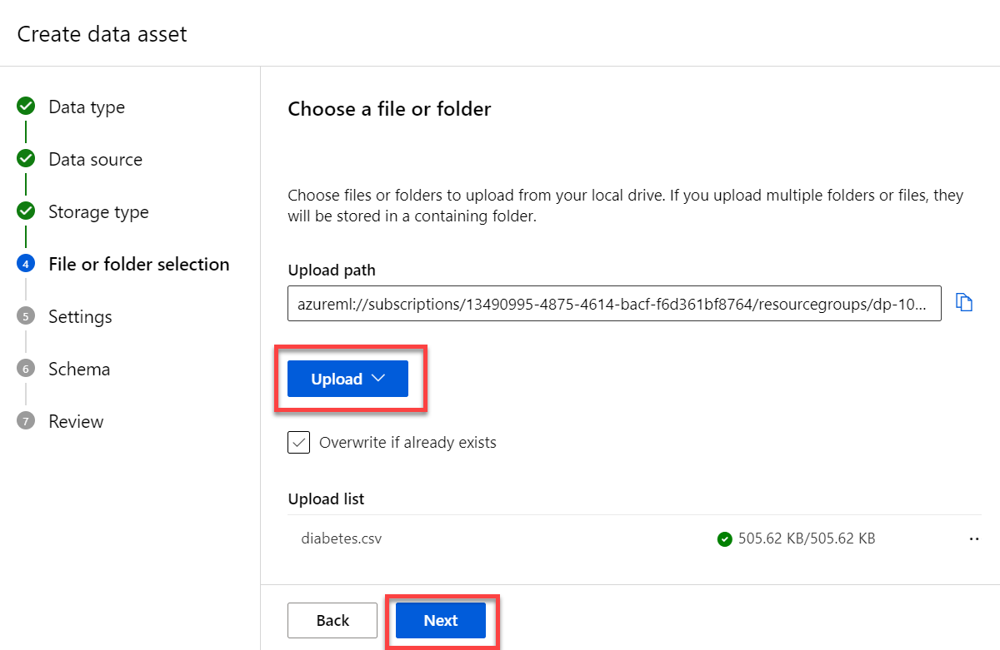
    
    * **in Settings pane, info for related fields then click on next**:
        * **File format**: Delimited
        * **Delimiter**: Comma
        * **Encoding**: UTF-8
        * **Column headers**: only first file has headers
        * **Skip rows**: None
        
    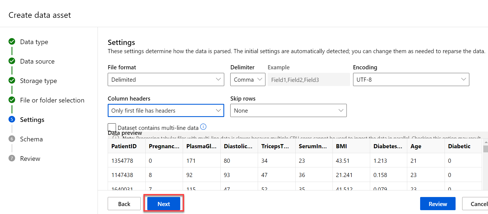
    
    * **Schema**:
        * Include all columns other than **Path**
        * Review the automatically detected types
    * **Confirm details**:
        * Do not profile the dataset after creation

## Create a designer pipeline

To get started with a designer, first, you must create a pipeline and add the dataset you want to work with.

1. In Azure Machine Learning Studio, view the **Designer** page and create a new pipeline.

    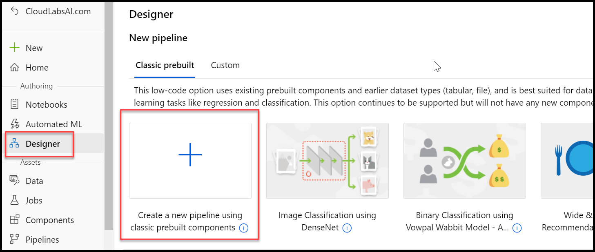

2. In the **&#9881; Settings** pane, change the default pipeline name (**Pipeline-Created-on-*date***) to **Visual Diabetes Training**.

    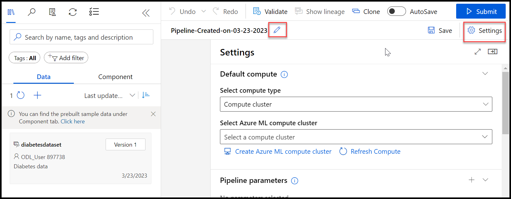

3. Note that you need to specify a compute target on which to run the pipeline. In the **Settings** pane, under **Select compute type** choose **compute cluster**, then under **Select Azure ML compute cluster** select the computer cluster that is created, click on **Save** and close this pane by selecting the close icon under Settings.

    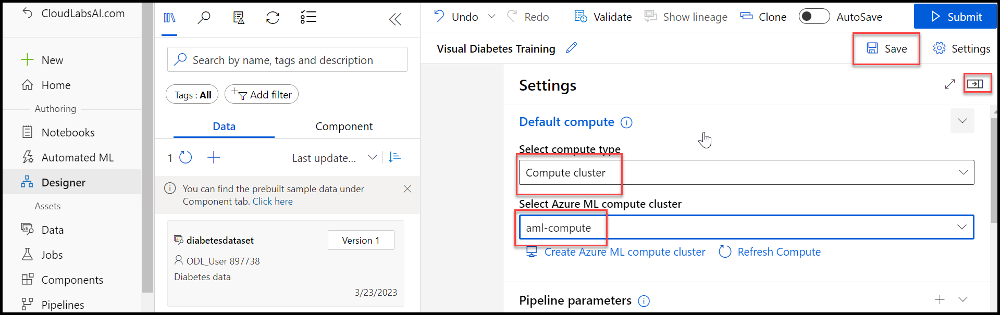
    
4. On the left side of the designer, Inside the **Data** section drag the **diabetesdataset** dataset onto the canvas.

    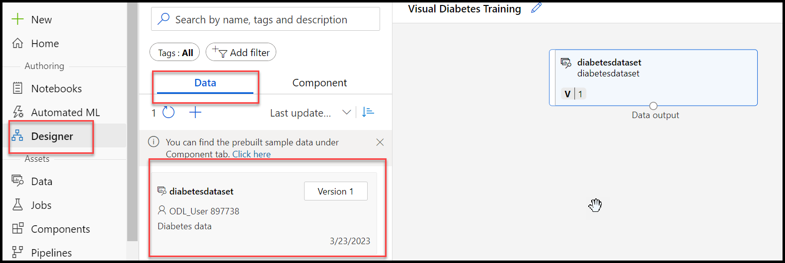

5. Select the **diabetesdataset** module on the canvas. Then right-click it, and on the **Preview data**.

6. In the DatasetOutput pane, select the **Profile** tab.

7. Review the schema of the data, noting that you can see the distributions of the various columns as histograms. Then close the visualization.

## Add transformations

Before you can train a model, you typically need to apply some preprocessing transformations to the data.

1. In the pane on the left, select the Component tab, which contains a wide range of components you can use to transform data before model training. You can search for components at the top of the pane.

2. Search and Drag a **Normalize Data** module to the canvas, below the **diabetesdataset** module. Then connect the output from the **diabetesdataset** module to the input of the **Normalize Data** module.

    

3. Double click on the **Normalize Data** module and view its settings, noting that it requires you to specify the transformation method and the columns to be transformed. Then, leaving the transformation as **ZScore**, edit the columns to include the following column names, click on **Save** and close:
    * PlasmaGlucose
    * DiastolicBloodPressure
    * TricepsThickness
    * SerumInsulin
    * BMI
    * DiabetesPedigree

    
    
        

    **Note**: We're normalizing the numeric columns putting them on the same scale, and avoiding columns with large values dominating model training. You'd normally apply a whole bunch of pre-processing transformations like this to prepare your data for training, but we'll keep things simple in this exercise.

4. Now we're ready to split the data into separate datasets for training and validation. In the pane on the left, in the **Components** section, search and drag a **Split Data** module onto the canvas under the **Normalize Data** module. Then connect the *Transformed Dataset* (left) output of the **Normalize Data** module to the input of the **Split Data** module.

5. Double click on the **Split Data** module, and configure its settings as follows, after configuring save and close this pane:
    * **Splitting mode** Split Rows
    * **Fraction of rows in the first output dataset**: 0.7
    * **Random seed**: 123
    * **Stratified split**: False

    

## Add model training modules

With the data prepared and split into training and validation datasets, you're ready to configure the pipeline to train and evaluate a model.

1. In the **Components** section in the pane on the left, search and drag a **Train Model** module to the canvas, under the **Split Data** module. Then connect the *Result dataset1* (left) output of the **Split Data** module to the *Dataset* (right) input of the **Train Model** module.

2. The model we're training will predict the **Diabetic** value, so double click on the **Train Model** module and modify its settings to set the **Label column** to  **Diabetic** (matching the case and spelling exactly!) click on **Save**, then again click on save and close the pane.

    

3. The **Diabetic** label the model will predict is a binary column (1 for patients who have diabetes, 0 for patients who don't), so we need to train the model using a *classification* algorithm. In the **Components** section, Search and drag a **Two-Class Logistic Regression** module to the canvas, to the left of the **Split Data** module, and above the **Train Model** module. Then connect its output to the **Untrained model** (left) input of the **Train Model** module.

    

4. To test the trained model, we need to use it to score the validation dataset we held back when we split the original data. In **Components** section, Search and drag a **Score Model** module to the canvas, below the **Train Model** module. Then connect the output of the **Train Model** module to the **Trained model** (left) input of the **Score Model** module; and drag the **Results dataset2** (right) output of the **Split Data** module to the **Dataset** (right) input of the **Score Model** module.

5. To evaluate how well the model performs, we need to look at some metrics generated by scoring the validation dataset. In the **Components** section, Search and drag an **Evaluate Model** module to the canvas, under the **Score Model** module, and connect the output of the **Score Model** module to the **Score dataset** (left) input of the **Evaluate Model** module.

    

## Run the training pipeline

With the data flow steps defined, you're now ready to run the training pipeline and train the model.

1. Verify that your pipeline looks similar to the following:

    

2. At the top right, click **Submit**. Then when prompted, create a new experiment named **mslearn-designer-train-diabetes**, and run it.  This will initialize the compute cluster and then run the pipeline, which may take 10 minutes or longer. You can see the status of the pipeline run above the top right of the design canvas.

    

    **Tip**: While it's running, you can view the pipeline and experiment that have been created in the **Pipelines** pages. Switch back to the **Visual Diabetes Training** pipeline on the **Designer** page when you're done.
    
    >Note: if the pipeline failed, perform the step-2 again.

3. After the **Normalize Data** module has been completed, Double click on it, on the **Outputs + logs** tab, under **Data outputs** in the **Transformed dataset** section, click the **preview Data** icon, and note that you can view statistics and distribution visualizations for the transformed columns.

    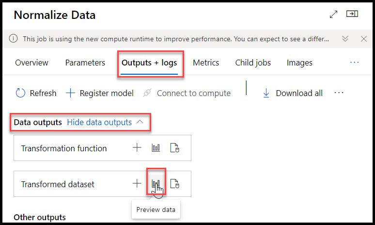

4. Close the **Normalize Data** visualizations and wait for the rest of the modules to complete. Then preview the output of the **Evaluate Model** module to see the performance metrics for the model.

    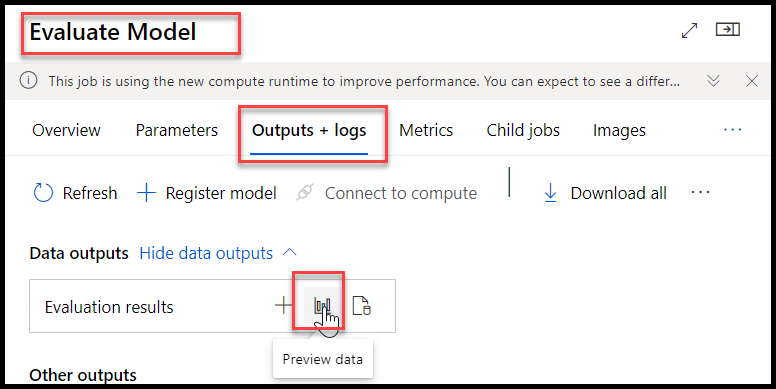

    **Note**: The performance of this model isn't all that great, partly because we performed only minimal feature engineering and pre-processing. You could try some different classification algorithms and compare the results (you can connect the outputs of the **Split Data** module to multiple **Train Model** and **Score Model** modules, and you can connect a second scored model to the **Evaluate Model** module to see a side-by-side comparison). The point of the exercise is simply to introduce you to the designer interface, not to train a perfect model!

## Create an inference pipeline

Now that you have used a *training pipeline* to train a model, you can create an *inference pipeline* that uses the trained model to predict labels for new data.

1. In the **Create inference pipeline** drop-down list, click **Real-time inference pipeline**. After a few seconds, a new version of your pipeline named **Visual Diabetes Training-real time inference** will be opened.

    

2. Rename the new pipeline to **Predict Diabetes**, and then review the new pipeline. Note that the normalization transformation and the trained model have been encapsulated in this pipeline so that the statistics from your training data will be used to normalize any new data values, and the trained model will be used to score the new data.

    

3. Note that the inference pipeline assumes that new data will match the schema of the original training data, so the **diabetesdataset** dataset from the training pipeline is included. However, this input data includes the **Diabetic** label that the model predicts, which is unintuitive to include in new patient data for which a diabetes prediction has not yet been made.

4. Delete the **diabetesdataset** dataset from the inference pipeline and replace it with an **Enter Data Manually** module from the **Components** section; connecting it to the same **dataset** input of the **Apply Transformation** module, in the **Components** section search and drag **Web Service Input** and connect it with the same **dataset** input of the **Apply Transformation** module. 

    

5. Then modify the settings of the **Enter Data Manually** module by double clicking it to use the following CSV input, which includes feature values without labels for three new patient observations, select save and close:

```CSV
PatientID,Pregnancies,PlasmaGlucose,DiastolicBloodPressure,TricepsThickness,SerumInsulin,BMI,DiabetesPedigree,Age
1882185,9,104,51,7,24,27.36983156,1.350472047,43
1662484,6,73,61,35,24,18.74367404,1.074147566,75
1228510,4,115,50,29,243,34.69215364,0.741159926,59
```

   

6. The inference pipeline includes the **Evaluate Model** module, which is not useful when predicting from new data, so delete this module.

7. The output from the **Score Model** module includes all of the input features as well as the predicted label and probability score. To limit the output to only the prediction and probability, delete the connection between the **Score Model** module and the **Web Service Output**, add an **Execute Python Script** module from the **Components** section, connect the output from the **Score Model** module to the **Dataset1** (left-most) input of the **Execute Python Script**, and connect the output of the **Execute Python Script** module to the **Web Service Output**. 

    

8. Then modify the settings of the **Execute Python Script** module double click on it to use the following code (replacing all existing code), click on save and close:

```Python
import pandas as pd

def azureml_main(dataframe1 = None, dataframe2 = None):

    scored_results = dataframe1[['PatientID', 'Scored Labels', 'Scored Probabilities']]
    scored_results.rename(columns={'Scored Labels':'DiabetesPrediction',
                                    'Scored Probabilities':'Probability'},
                            inplace=True)
    return scored_results
```

> **Note**: After pasting the code in the **Execute Python Script** module, verify that the code looks similar to the code above. Indentations are important in Python and the module will fail if the indentations are not copied correctly. 

   

9. Verify that your pipeline looks similar to the following:

    

10. Submit the pipeline as a new experiment named **mslearn-designer-predict-diabetes** on the compute cluster you used for training. This may take a while!

    
    

## Deploy the inference pipeline as a web service

Now you have an inference pipeline for real-time inferencing, which you can deploy as a web service for client applications to use.

> **Note**: In this exercise, you'll deploy the web service to an Azure Container Instance (ACI). This type of compute is created dynamically and is useful for development and testing. For production, you should create an *inference cluster*, which provides an Azure Kubernetes Service (AKS) cluster that provides better scalability and security.

1. If the **Predict Diabetes** inference pipeline has not yet finished running, await its completion. Then visualize the **Result dataset** output of the **Execute Python Script** module to see the predicted labels and probabilities for the three patient observations in the input data.

2. At the top right, click **Deploy**, and deploy a new real-time endpoint, using the following settings:
    -  **Name**: designer-predict-diabetes
    -  **Description**: Predict diabetes.
    - **Compute type**: Azure Container Instance

    
    
        

3. Wait for the web service to be deployed - this can take several minutes(Approx 30 Minutes). The deployment status is shown at the top left of the designer interface.

## Test the web service

Now you can test your deployed service from a client application - in this case, you'll use a notebook.

1. On the **Endpoints** page, open the **designer-predict-diabetes** real-time endpoint.

    

2. When the **designer-predict-diabetes** endpoint opens, on the **Consume** tab, note the **REST endpoint** and **Primary key** values.

    

3. With the **Consume** page for the **designer-predict-diabetes** service page open in your browser, open a new browser tab and open a second instance of Azure Machine Learning studio. Then in the new tab, view the **Notebooks** page.

4. In the **Notebooks** page, under **My files**, browse to the **Users/mslearn-dp100** folder where you cloned the notebook repository and open the **Get Designer Prediction** notebook.

    

5. When the notebook has opened, ensure that the compute instance **Notebook-<inject key="DeploymentID" enableCopy="false"/>** is selected in the **Compute** box and that it has a status of **Running**.

6. In the notebook, replace the **ENDPOINT** and **PRIMARY_KEY** placeholders with the values for your service, which you can copy from the **Consume** tab on the page for your endpoint.

    

7. Run the code cell and view the output returned by your web service.

    
